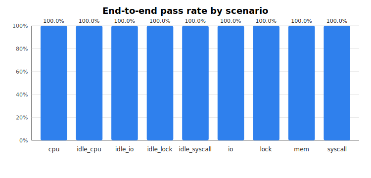
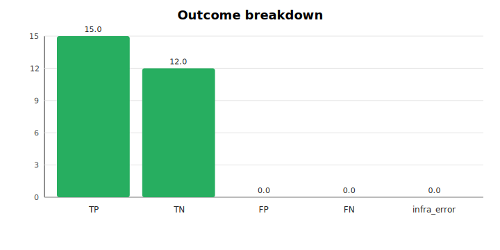

# ebpf-rca 多轮准确率评测报告

- 生成时间：2026-07-08T09:21:16Z
- Kernel：6.6.0-22-generic
- 架构：x86_64
- workload：`stress`
- repeat：3
- 总运行数：27，有效运行数：27
- 诊断准确率：100.0%
- 端到端通过率：100.0%

## 1. 统计口径

- 正例命中：`passed=true` 且 `matched_reports` 非空，记为 TP；否则记为 FN。
- 负例命中：`passed=true` 且 `report_count=0`，记为 TN；否则记为 FP。
- `check.json` 缺失或无法解析记为 infra_error。
- `extra_report_count` 单独统计，不混入 TP/FN。

## 2. 汇总表

| 场景 | 类型 | 运行数 | TP | TN | FP | FN | infra | 诊断准确率 | 端到端通过率 | 召回率 | 误报率 | 平均额外报告 |
|---|---|---:|---:|---:|---:|---:|---:|---:|---:|---:|---:|---:|
| cpu | positive | 3 | 3 | 0 | 0 | 0 | 0 | 100.0% | 100.0% | 100.0% | NA | 0.00 |
| idle_cpu | negative | 3 | 0 | 3 | 0 | 0 | 0 | 100.0% | 100.0% | NA | 0.0% | 0.00 |
| idle_io | negative | 3 | 0 | 3 | 0 | 0 | 0 | 100.0% | 100.0% | NA | 0.0% | 0.00 |
| idle_lock | negative | 3 | 0 | 3 | 0 | 0 | 0 | 100.0% | 100.0% | NA | 0.0% | 0.00 |
| idle_syscall | negative | 3 | 0 | 3 | 0 | 0 | 0 | 100.0% | 100.0% | NA | 0.0% | 0.00 |
| io | positive | 3 | 3 | 0 | 0 | 0 | 0 | 100.0% | 100.0% | 100.0% | NA | 0.00 |
| lock | positive | 3 | 3 | 0 | 0 | 0 | 0 | 100.0% | 100.0% | 100.0% | NA | 0.00 |
| mem | positive | 3 | 3 | 0 | 0 | 0 | 0 | 100.0% | 100.0% | 100.0% | NA | 0.00 |
| syscall | positive | 3 | 3 | 0 | 0 | 0 | 0 | 100.0% | 100.0% | 100.0% | NA | 0.00 |

## 3. 图表

## 4. 明细位置

- 每轮明细：`accuracy_runs.csv`
- 汇总 CSV：`accuracy_summary.csv`
- 机器可读汇总：`accuracy_summary.json`

## 5. 失败/异常轮次

无。
